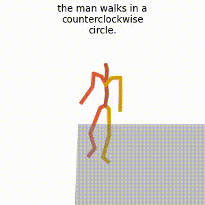
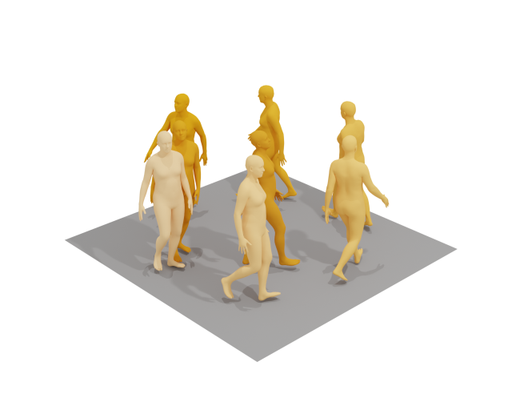
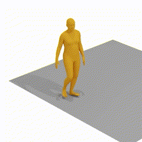
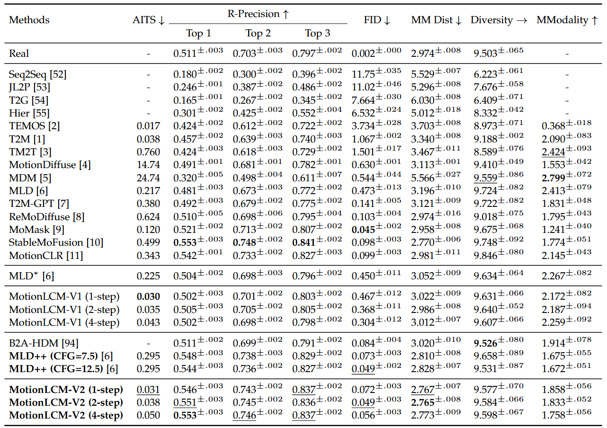
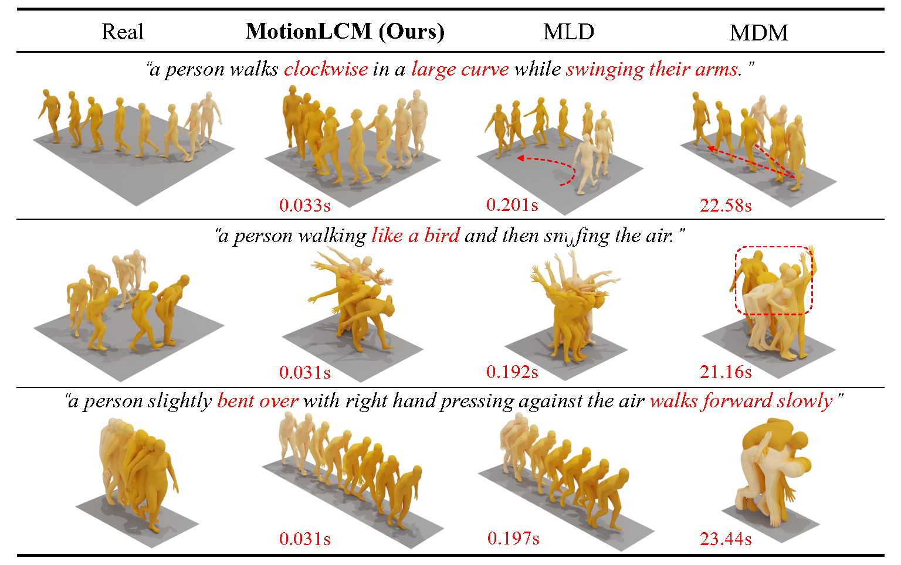
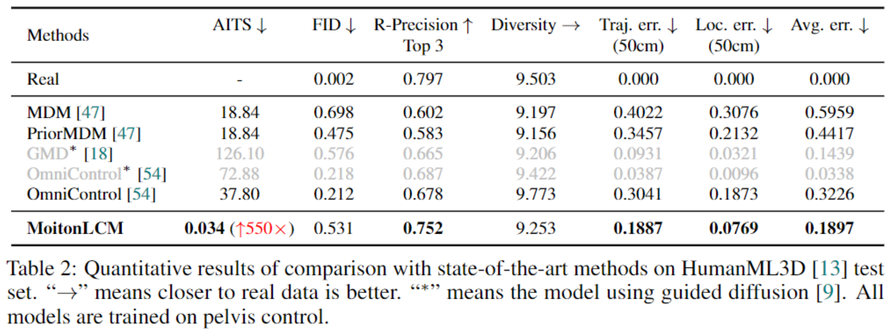

# MotionLCM: Real-time Controllable Motion Generation via Latent Consistency Model

[Wenxun Dai](https://github.com/Dai-Wenxun)<sup>😎</sup>, [Ling-Hao Chen](https://lhchen.top)<sup>😎</sup>, [Jingbo Wang](https://wangjingbo1219.github.io)<sup>🥳</sup>, [Jinpeng Liu](https://moonsliu.github.io/)<sup>😎</sup>, [Bo Dai](https://daibo.info/)<sup>🥳</sup>, [Yansong Tang](https://andytang15.github.io)<sup>😎</sup>

<sup>😎</sup>Tsinghua University, <sup>🥳</sup>Shanghai AI Laboratory (Correspondence: Jingbo Wang and Bo Dai).

<p align="center">
  <a href='https://arxiv.org/abs/2404.19759'>
  </a> 
  <a href='https://arxiv.org/pdf/2404.19759.pdf'>
  </a> 
  <a href='https://huggingface.co/spaces/wxDai/MotionLCM'>
  </a>
  <a href='https://dai-wenxun.github.io/MotionLCM-page'>
  </a> 
  <a href='https://youtu.be/BhrGmJYaRE4'>
  </a> 
  <a href='https://www.bilibili.com/video/BV1uT421y7AN/'>
  </a>
  <a href='https://github.com/Dai-Wenxun/MotionLCM'>
  </a> 
  <a href='LICENSE'>
  </a> 
  <a href="" target='_blank'>
  </a> 
</p>


## 🤩 Abstract

> This work introduces MotionLCM, extending controllable motion generation to a real-time level. 
Existing methods for spatial control in text-conditioned motion generation suffer from significant runtime inefficiency. 
To address this issue, we first propose the motion latent consistency model (MotionLCM) for motion generation, 
building upon the latent diffusion model (MLD). By employing one-step (or few-step) inference, 
we further improve the runtime efficiency of the motion latent diffusion model for motion generation. 
To ensure effective controllability, we incorporate a motion ControlNet within the latent space of MotionLCM 
and enable explicit control signals (e.g., pelvis trajectory) in the vanilla motion space to control the generation process directly, 
similar to controlling other latent-free diffusion models for motion generation. By employing these techniques, 
our approach can generate human motions with text and control signals in real-time. 
Experimental results demonstrate the remarkable generation and controlling capabilities of MotionLCM while maintaining real-time runtime efficiency.

## 📢 News

- **[2024/08/15]** Support the training of motion latent diffusion model (MLD).
- **[2024/08/09]** Support the training of motion VAE.
- **[2024/07/02]** MotionLCM is officially accepted by **ECCV 2024**.
- **[2024/05/01]** Upload paper and release code.

## 👨‍🏫 Quick Start

This section provides a quick start guide to set up the environment and run the demo. The following steps will guide you through the installation of the required dependencies, downloading the pretrained models, and preparing the datasets. 

<details>
  <summary><b> 1. Conda environment </b></summary>

```
conda create python=3.10 --name motionlcm
conda activate motionlcm
```

Install the packages in `requirements.txt` and install [PyTorch 1.13.1](https://pytorch.org/).

```
pip install -r requirements.txt
```

We test our code on Python 3.10.12 and PyTorch 1.13.1.

</details>

<details>
  <summary><b> 2. Dependencies </b></summary>

If you have the `sudo` permission, install `ffmpeg` for visualizing stick figure (if not already installed):

```
sudo apt update
sudo apt install ffmpeg
ffmpeg -version  # check!
```

If you do not have the `sudo` permission to install it, please install it via `conda`: 

```
conda install conda-forge::ffmpeg
ffmpeg -version  # check!
```

Run the following command to install [`git-lfs`](https://git-lfs.com/):
```
conda install conda-forge::git-lfs
```

Run the script to download dependencies materials:

```
bash prepare/download_glove.sh
bash prepare/download_t2m_evaluators.sh
bash prepare/prepare_t5.sh
bash prepare/download_smpl_models.sh
```

</details>

<details>
  <summary><b> 3. Pretrained models </b></summary>

Run the script to download the pretrained models:

```
bash prepare/download_pretrained_models.sh
```

The folders `experiments_t2m` and `experiments_control` store pretrained models for text-to-motion and motion control respectively.

</details>


<details>
  <summary><b> 4. (Optional) Download manually </b></summary>

Visit the [Google Driver](https://drive.google.com/drive/folders/1SIhb6srXWS0PNvZ2fs40QiE3Rk764u6z?usp=sharing) to download the previous dependencies and models.

</details>

<details>
  <summary><b> 5. Prepare the datasets </b></summary>

Please refer to [HumanML3D](https://github.com/EricGuo5513/HumanML3D) for text-to-motion dataset setup. Copy the result dataset to our repository:
```
cp -r ../HumanML3D/HumanML3D ./datasets/humanml3d
```

The unofficial method of data preparation can be found in this [issue](https://github.com/Dai-Wenxun/MotionLCM/issues/6).

</details>

<details>
  <summary><b> 6. Folder Structure </b></summary>

After the whole setup pipeline, the folder structure will look like:

```
MotionLCM
├── configs
├── datasets
│   ├── humanml3d
│   │   ├── new_joint_vecs
│   │   ├── new_joints
│   │   ├── texts
│   │   ├── Mean.npy
│   │   ├── Std.npy
│   │   ├── ...
│   └── humanml_spatial_norm
│       ├── Mean_raw.npy
│       └── Std_raw.npy
├── deps
│   ├── glove
│   ├── sentence-t5-large
|   ├── smpl_models
│   └── t2m
├── experiments_control
│   ├── mld_humanml
│   │   └── mld_humanml.ckpt
│   └── motionlcm_humanml
│       └── motionlcm_humanml.ckpt
├── experiments_t2m
│   ├── mld_humanml
│   │   └── mld_humanml.ckpt
│   └── motionlcm_humanml
│       └── motionlcm_humanml.ckpt
├── ...
```

</details>

## 🎬 Demo

MotionLCM provides two main functionalities: text-to-motion and motion control. The following commands demonstrate how to use the pretrained models to generate motions. The outputs will be stored in `${cfg.TEST_FOLDER} / ${cfg.NAME} / demo_${timestamp}` (`experiments_t2m_test/motionlcm_humanml/demo_2024-04-06T23-05-07`).

<details>
  <summary><b> 1. Text-to-Motion (using provided prompts and lengths in `demo/example.txt`) </b></summary>

If you haven't completed `5. Prepare the datasets` in `👨‍🏫 Quick Start`, make sure to use the following command to download a tiny humanml3d dataset. The model instantiation requires the motion feature dimension of the dataset.

```
bash prepare/prepare_tiny_humanml3d.sh
```

Then, run the demo:

```
python demo.py --cfg configs/motionlcm_t2m.yaml --example assets/example.txt
```

</details>

<details>
  <summary><b> 2. Text-to-Motion (using prompts from HumanML3D test set) </b></summary>

```
python demo.py --cfg configs/motionlcm_t2m.yaml
```
</details>

<details>
  <summary><b> 3. Motion Control (using prompts and trajectory from HumanML3D test set) </b></summary>

```
python demo.py --cfg configs/motionlcm_control.yaml
```

</details>

<details>
  <summary><b> 4. Render SMPL </b></summary>

After running the demo, the output folder will store the stick figure animation for each generated motion (e.g., `assets/example.gif`).



To record the necessary information about the generated motion, a pickle file with the following keys will be saved simultaneously (e.g., `assets/example.pkl`):

- `joints (numpy.ndarray)`: The XYZ positions of the generated motion with the shape of `(nframes, njoints, 3)`.
- `text (str)`: The text prompt.
- `length (int)`: The length of the generated motion.
- `hint (numpy.ndarray)`: The trajectory for motion control (optional).

<details>
  <summary><b> 4.1 Create SMPL meshes </b></summary>

To create SMPL meshes for a specific pickle file, let's use `assets/example.pkl` as an example:

```
python fit.py --pkl assets/example.pkl
```

The SMPL meshes (numpy array) will be stored in `assets/example_mesh.pkl` with the shape `(nframes, 6890, 3)`.

You can also fit all pickle files within a folder. The code will traverse all `.pkl` files in the directory and filter out files that have already been fitted.

```
python fit.py --dir assets/
```

</details>

<details>
  <summary><b> 4.2 Render SMPL meshes </b></summary>

Refer to [TEMOS-Rendering motions](https://github.com/Mathux/TEMOS) for blender setup (only **Installation** section). 

We support three rendering modes for SMPL mesh, namely `sequence` (default), `video` and `frame`.

<details>
  <summary><b> 4.2.1 sequence </b></summary>

```
YOUR_BLENDER_PATH/blender --background --python render.py -- --pkl assets/example_mesh.pkl --mode sequence --num 8
```

You will get a rendered image of `num=8` keyframes as shown in `assets/example_mesh.png`. The darker the color, the later the time.



</details>

<details>
  <summary><b> 4.2.2 video </b></summary>

```
YOUR_BLENDER_PATH/blender --background --python render.py -- --pkl assets/example_mesh.pkl --mode video --fps 20
```

You will get a rendered video with `fps=20` as shown in `assets/example_mesh.mp4`.



</details>

<details>
  <summary><b> 4.2.3 frame </b></summary>

```
YOUR_BLENDER_PATH/blender --background --python render.py -- --pkl assets/example_mesh.pkl --mode frame --exact_frame 0.5
```

You will get a rendered image of the keyframe at `exact_frame=0.5` (i.e., the middle frame) as shown in `assets/example_mesh_0.5.png`.


</details>

</details>

</details>

## 🚀 Train your own models

We provide the training guidance for both text-to-motion and motion control tasks. The following steps will guide you through the training process.

<details>
  <summary><b> 1. Important args in the config yaml </b></summary>

The parameters required for model training and testing are recorded in the corresponding YAML file (e.g., `configs/motionlcm_t2m.yaml`). Below are some of the important parameters in the file:

- `${FOLDER}`: The folder for the specific training task (i.e., `experiments_t2m` and `experiments_control`).
- `${TEST_FOLDER}`: The folder for the specific testing task (i.e., `experiments_t2m_test` and `experiments_control_test`).
- `${NAME}`: The name of the model (e.g., `motionlcm_humanml`). `${FOLDER}`, `${NAME}`, and the current timestamp constitute the training output folder (for example, `experiments_t2m/motionlcm_humanml/2024-04-06T23-05-07`). The same applies to `${TEST_FOLDER}` for testing.
- `${TRAIN.PRETRAINED}`: The path of the pretrained model.
- `${TEST.CHECKPOINTS}`: The path of the testing model.

</details>

<details>
  <summary><b> 2. Train MotionLCM and motion ControlNet </b></summary>

#### 2.1. Ready to train motion VAE and MLD (optional)

Please update the parameters in `configs/vae.yaml` and `configs/mld_t2m.yaml`. Then, run the following commands:

```
python -m train_vae --cfg configs/vae.yaml
python -m train_mld --cfg configs/mld_t2m.yaml
```

This step is **OPTIONAL** since we provide pre-trained models for training MotionLCM and motion ControlNet.

#### 2.2. Ready to train MotionLCM

Please first check the parameters in `configs/motionlcm_t2m.yaml`. Then, run the following command (**13GB usage**):

```
python -m train_motionlcm --cfg configs/motionlcm_t2m.yaml
```

#### 2.3. Ready to train motion ControlNet

Please update the parameters in `configs/motionlcm_control.yaml`. Then, run the following command (**16GB usage**):

```
python -m train_motion_control --cfg configs/motionlcm_control.yaml
```

</details>

<details>
  <summary><b> 3. Evaluate the model </b></summary>

Text-to-Motion: 

```
python -m test --cfg configs/motionlcm_t2m.yaml
```

Motion Control:

```
python -m test --cfg configs/motionlcm_control.yaml
```

</details>

## 📊 Results

We provide the quantitative and qualitative results in the paper. 

<details>
  <summary><b> Text-to-Motion (quantitative)  </b></summary>


</details>

<details>
  <summary><b> Text-to-Motion (qualitative)  </b></summary>


</details>

<details>
  <summary><b> Motion Control (quantitative)  </b></summary>


</details>

## 🌹 Acknowledgement

We would like to thank the authors of the following repositories for their excellent work: 
[MLD](https://github.com/ChenFengYe/motion-latent-diffusion), 
[latent-consistency-model](https://github.com/luosiallen/latent-consistency-model), 
[OmniControl](https://github.com/neu-vi/omnicontrol), 
[TEMOS](https://github.com/Mathux/TEMOS),
[HumanML3D](https://github.com/EricGuo5513/HumanML3D),
[UniMoCap](https://github.com/LinghaoChan/UniMoCap),
[joints2smpl](https://github.com/wangsen1312/joints2smpl).

## 📜 Citation

If you find this work useful, please consider citing our paper:

```bash
@article{motionlcm,
  title={MotionLCM: Real-time Controllable Motion Generation via Latent Consistency Model},
  author={Dai, Wenxun and Chen, Ling-Hao and Wang, Jingbo and Liu, Jinpeng and Dai, Bo and Tang, Yansong},
  journal={arXiv preprint arXiv:2404.19759},
  year={2024},
}
```

## 📚 License

This code is distributed under an [MotionLCM LICENSE](LICENSE), which not allowed for commercial usage. Note that our code depends on other libraries and datasets which each have their own respective licenses that must also be followed.

## 🌟 Star History

<p align="center">
    <a href="https://star-history.com/#Dai-Wenxun/MotionLCM" target="_blank">
        
    </a>
<p>

If you have any question, please contact at Wenxun Dai and cc to Ling-Hao Chen and Jingbo Wang.
